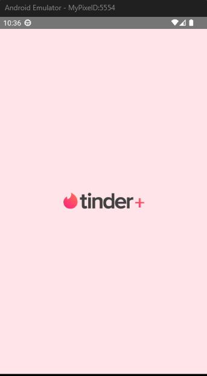
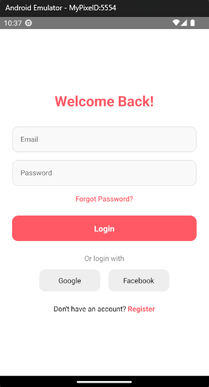
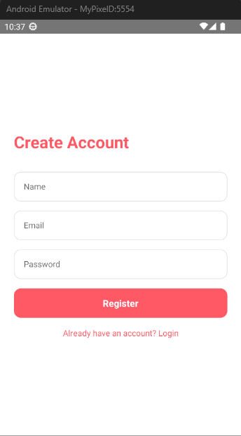
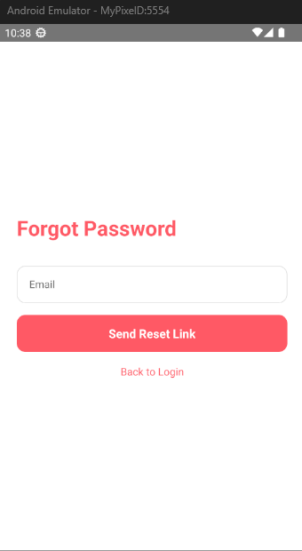
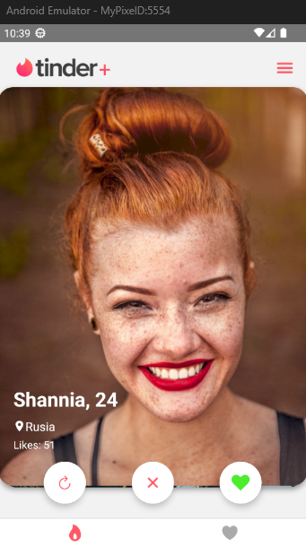
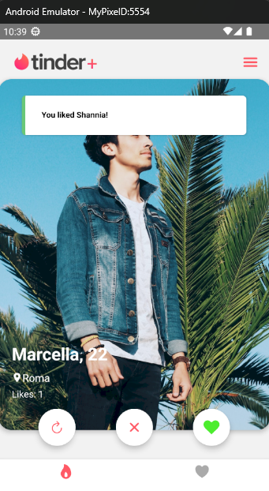
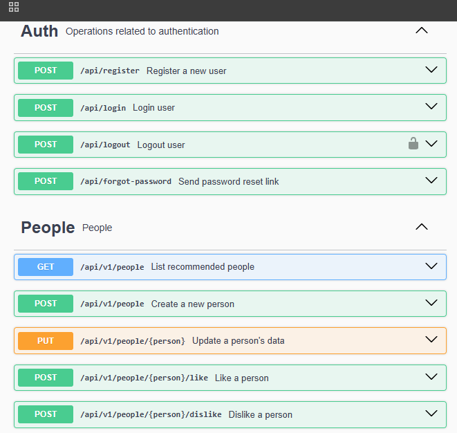

# 📱 NotionAppTinder

NotionAppTinder is a React Native mobile application inspired by Tinder’s swipe interface, integrated with Notion API for managing and displaying user data dynamically.  
This project demonstrates smooth card-swiping interactions, data fetching with React Query, and a modern UI design optimized for mobile devices.

---

## 🚀 Features

- 🔄 Swipe left/right to like or skip profiles  
- 💓 Like counter updates dynamically  
- 📦 Data fetching using React Query  
- 🌐 REST API backend built with Laravel  
- 🎨 Responsive and clean UI inspired by Tinder  

---

## 🛠️ Tech Stack

**Frontend (React Native):**
- React Native
- TypeScript
- React Query
- Axios
- React Native Deck Swiper
- React Navigation
- Vector Icons (Ionicons, FontAwesome)
- recoil
- atomic design

**Backend (Laravel API):**
- Laravel 10+
- MySQL
- Sanctum / Passport Authentication
- Swagger API Documentation
- http://hyperhire_notion_test.test/api/documentation#/People  --> sample in laragon

---

## ⚙️ Setup Instructions

### 1️⃣ Clone the Repositories

```bash
# Backend (Laravel)
git clone https://github.com/RoniPaslan/hyperhire_notion_test.git

# React Native App
git clone https://github.com/RoniPaslan/notionAppTinder.git

### 2 Install Dependencies
cd notionAppTinder
npm install

### 3 Run the App
npm start
# or
npx react-native run-android
# or
npx react-native run-ios

🎬 Preview Video
You can watch a short demo of the app in action below:

https://github.com/RoniPaslan/notionAppTinder/blob/main/preview/Recording-sample.mp4

(If the video doesn’t autoplay, click the link above to open it on GitHub.)

## 🎬 Preview Video

You can watch a short demo of the app in action below:

[▶️ Watch Demo Video](preview/Recording-sample.mp4)

> *(Click the link above to view the demo video on GitHub)*

---

## 🖼️ App Screenshots

### Splash & Login Screens



### Register & Forgot Password Screens



### Home & Like Screens



### Swagger API Preview
<p align="center">
  
</p>


👨‍💻 Author
Roni Paslan
📧 ronipaslan4@gmail.com

🌐 GitHub Profile

